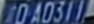

<!--
 * @Author: zhouyuchong
 * @Date: 2023-10-30 14:43:57
 * @Description: 
 * @LastEditors: zhouyuchong
 * @LastEditTime: 2023-10-30 15:35:39
-->
# Custom gst-nvinfer (DEMO)
This is a custom gst-nvinfer plugin to do some preprocess.

## Requirements
+ Deepstream 6.0+
+ Opencv

## Notice
This demo supports models:
+ [Retinaface](https://github.com/wang-xinyu/tensorrtx/tree/master/retinaface)
+ [Retina_License_Plate](https://github.com/gm19900510/Pytorch_Retina_License_Plate)
+ [Hyperlpr](https://github.com/szad670401/HyperLPR)

If want to use other models, codes in `tensor_extractor.cpp` should be modified for extracting landmarks from original tensor-output and `align_funcitons`.

## Usage
1. set cuda environment

```
export CUDA_VER=10.2
```
2. compile Makefile

make sure all path & version in Makefile is correct.

```
make
make install
```
NOTE: To compile the sources, run make with "sudo" or root permission.

3. set config file

first to set primary gie's output-tensor-meta to true. For example, in retinaface config file:
```
output-tensor-meta=1
```

use kyewords
+ alignment-type: 
  + 1: face -> [Retinaface](https://github.com/wang-xinyu/tensorrtx/tree/master/retinaface)
  + 2: license plate -> [Retina_License_Plate](https://github.com/gm19900510/Pytorch_Retina_License_Plate)
  + 3: lpr3 -> [Hyperlpr](https://github.com/szad670401/HyperLPR)
+ alignment-parent: indicates whether user-meta data stored in frame-meta or in object-meta
  + 1: frame-meta
  + 2: object-meta
+ alignment-pics: save pictures or not


Example
```
alignment-type=2
alignment-parent=2
alignment-pics=1
alignment-debug-level=3
```


## Comparison
License Plate

Saved input NvBufSurface



## TODO
use [npp](https://docs.nvidia.com/cuda/npp/group__affine__transform.html#ga5e722e6c67349032d4cacda4a696c237) to do alignment