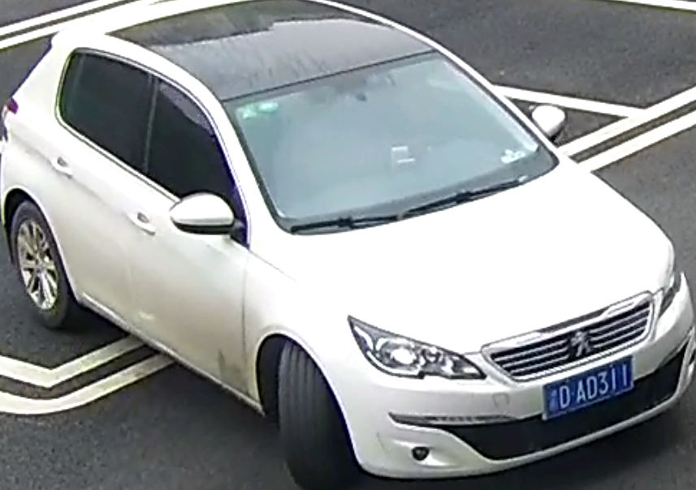
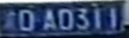

<!--
 * @Author: zhouyuchong
 * @Date: 2024-02-26 14:51:58
 * @Description: 
 * @LastEditors: zhouyuchong
 * @LastEditTime: 2024-03-07 15:36:55
-->
# Custom gst-nvinfer (DEMO)
This is a custom gst-nvinfer plugin to do some preprocess and postprocess.

## Requirements
+ Deepstream 6.0+
+ Opencv

## Notice
This demo supports models:
+ [Retinaface](https://github.com/wang-xinyu/tensorrtx/tree/master/retinaface)
+ [Retina_License_Plate](https://github.com/gm19900510/Pytorch_Retina_License_Plate)
+ [Hyperlpr](https://github.com/szad670401/HyperLPR)

If want to use other models, codes in `tensor_extractor.cpp` should be modified for extracting landmarks from original tensor-output and `align_funcitons`.

## Usage
1. replace `nvdsinfer.h`. It's under `/opt/nvidia/deepstream/deepstream-6.1/sources/includes` in official docker.
1. set cuda environment
```
export CUDA_VER=11.6
```
2. compile Makefile
```
make
make install
```
NOTE: To compile the sources, run make with "sudo" or root permission.

3. set config file
for detector which output landmarks
```
enable-output-landmark = 1
```

use kyewords
+ alignment-type: 
  + 1: face -> [Retinaface](https://github.com/wang-xinyu/tensorrtx/tree/master/retinaface)
  + 2: license plate -> [Retina_License_Plate](https://github.com/gm19900510/Pytorch_Retina_License_Plate)
  + 3: lpr3 -> [Hyperlpr](https://github.com/szad670401/HyperLPR)

+ alignment-pics-path: path to save pics
NOTE:need a tracker after detector to get track-id for filename, or modify [codes]().

Example
```
alignment-type=2
alignment-pics-path=/path/to/save/images
```

## Comparison
License Plate

Saved input NvBufSurface



## TODO
use [npp](https://docs.nvidia.com/cuda/npp/group__affine__transform.html#ga5e722e6c67349032d4cacda4a696c237) to do alignment